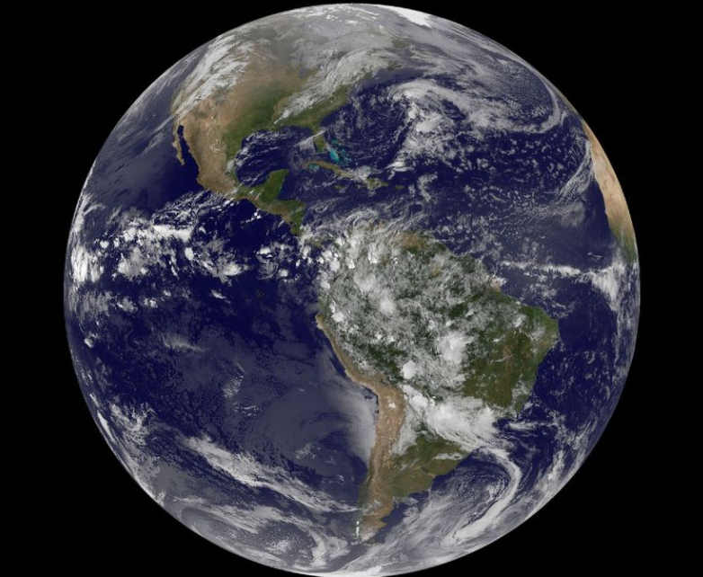

<a href=”assign2.html”>Assignment 2 - Movie Profiles</a>
<html>
<head>

</head>
<body>

<h1>World tour</h1>

Day 1, We go to Paris for 3 days on Dec 8th

Day 2, We go to Rome for 4 days on Dec 11th

Day 3, We go to London for 2 days on Dec 15th

Day 4, We go to Tokyo for 5 days on Dec 17th

Tickets can be bought online and at the airport

</body>
</html>
